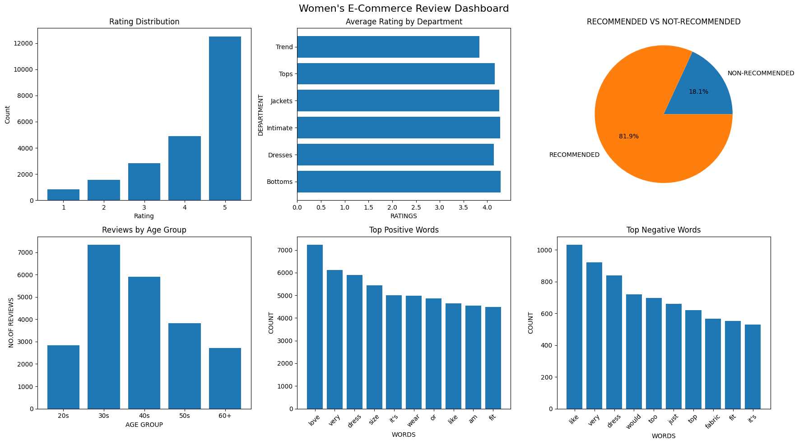

# Women's E-Commerce Review Analyzer

A Python tool that automatically analyzes customer reviews 
and generates a business insight dashboard from raw e-commerce data.

## What it does
- Cleans and processes 22,000+ real customer reviews
- Identifies rating patterns across departments
- Analyzes most common words in positive vs negative reviews
- Generates a 6-chart visual dashboard

## Dashboard


## How to run
```python
from review_analyzer import ReviewAnalyzer
analyzer = ReviewAnalyzer("your_reviews.csv")
```

## Dataset
Women's E-Commerce Clothing Reviews — 23,000+ reviews
Source: Kaggle

## Tech Stack
Python, Pandas, Matplotlib
